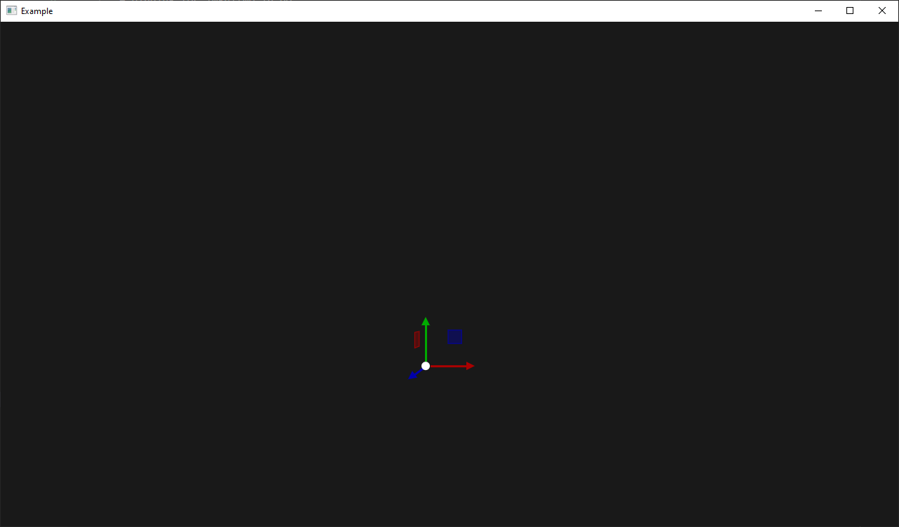

# imguizmo-go

A binding for imguizmo in Go.

## Example

## Compatibility

You're expected to use my [imgui-go](https://github.com/nitrix/imgui-go) library with this.

## Credits

Credits goes to the original author of the [imguizmo](https://github.com/CedricGuillemet/ImGuizmo) library as well as [cimguizmo](https://github.com/cimgui/cimguizmo) that I'm re-using for the Cgo bindings.

## License

This is free and unencumbered software released into the public domain. See the [UNLICENSE](UNLICENSE) file for more details.
